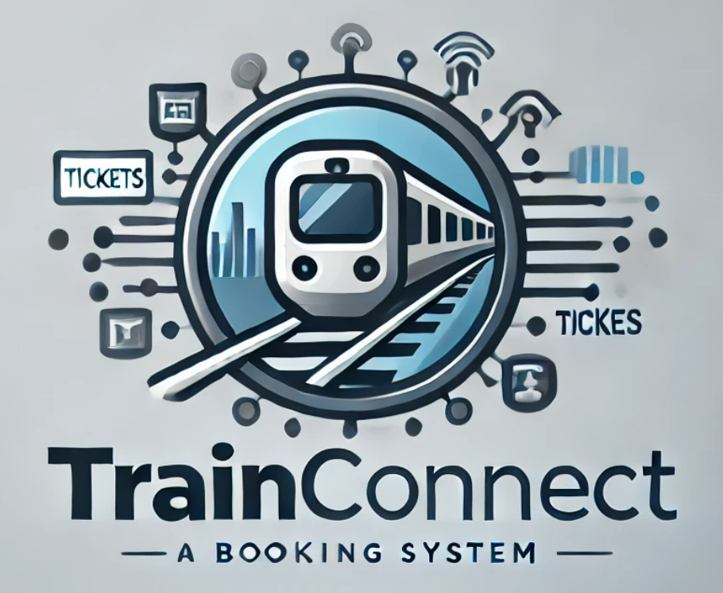
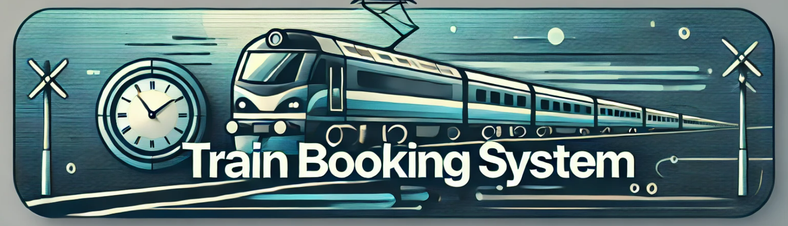

<div align="center">
  

  <h1>Train Booking System Java</h1>

  <p>
    A Java Swing desktop application for train ticket booking, passenger management,
    payment receipt generation, and admin sales analysis.
  </p>

  <p>
    
    
    
    
  </p>
</div>

---

## Table of Contents

- [Project Overview](#project-overview)
- [Features](#features)
- [Tech Stack](#tech-stack)
- [Installation](#installation)
- [Usage](#usage)
- [Screenshots](#screenshots)
- [Demo](#demo)
- [Folder Structure](#folder-structure)
- [Future Improvements](#future-improvements)
- [Contact Information](#contact-information)

---

## Project Overview

**Train Booking System Java** is a desktop-based train ticket booking system built with
Java and Swing dialog interfaces. The project simulates a complete booking workflow,
from passenger registration and route selection to ticket pricing, payment, receipt
printing, and admin reporting.

The system is also designed to demonstrate core data structure concepts through custom
implementations of linked lists, queues, and stacks. Customer records are managed with
queues, ticket records are handled with stacks, and an infix-to-postfix utility is
included as an additional data structure feature.

---

## Features

### Customer Module

- Register one or more passengers in a single booking session.
- Capture passenger details such as name, phone number, IC number, age, and gender.
- Generate random customer IDs.
- Select origin and destination stations:
  - Tapah Road
  - Ipoh
  - Kajang
  - KL Sentral
- Choose one-way or return tickets.
- Select ticket type:
  - Gold
  - Silver
- Add optional travel packages:
  - Food only
  - Drink only
  - Food and drink
  - No package
- Apply category-based pricing for adults, children, and senior citizens.
- Edit customer information.
- Refund customer tickets.
- Search customers by ticket type.
- Generate payment receipts with transaction details.

### Admin Module

- View average ticket sales.
- Identify the highest ticket payment.
- Identify the lowest ticket payment.
- Count total tickets sold by ticket type.
- Convert infix expressions to postfix notation.

### Data Structure Concepts

- Custom `LinkedList` implementation.
- Queue operations for customer management.
- Stack operations for ticket management.
- Node-based object storage.
- Infix-to-postfix expression conversion using stack logic.

---

## Tech Stack

| Category | Technology |
| --- | --- |
| Language | Java |
| User Interface | Java Swing, `JOptionPane` |
| IDE Support | BlueJ |
| Core Concepts | Object-Oriented Programming, Linked List, Queue, Stack |
| Assets | PNG image resources |

---

## Installation

### Prerequisites

Make sure you have the following installed:

- Java Development Kit (JDK) 8 or newer
- Git
- BlueJ, optional if you want to open the project with the included BlueJ files

### Clone the Repository

```bash
git clone https://github.com/Xid03/TrainBookingSystemJava.git
cd TrainBookingSystemJava
```

### Compile the Project

```bash
javac *.java
```

### Run the Application

```bash
java TrainBookingApp
```

---

## Usage

1. Launch the application with `java TrainBookingApp`.
2. Choose **Customer** to start a booking flow or **Admin** to view reporting tools.
3. In the customer flow, enter passenger information, route details, ticket type, and package options.
4. Review ticket pricing and complete payment.
5. Use the admin menu to inspect sales summaries, ticket totals, and expression conversion.

---

## Screenshots

The project currently includes visual assets used by the Swing dialogs.

<div align="center">
  <table>
    <tr>
      <td align="center">
        
        <br />
        <strong>Application Logo</strong>
      </td>
      <td align="center">
        
        <br />
        <strong>Application Background</strong>
      </td>
    </tr>
  </table>
</div>

Recommended screenshot additions:

- Welcome dialog
- Customer booking form
- Ticket price selection
- Payment receipt
- Admin analytics menu

---

## Demo

This is a desktop Java application, so there is no hosted web demo. To demo the project
locally, compile and run it from the terminal:

```bash
javac *.java
java TrainBookingApp
```

Suggested demo flow:

1. Start the app and choose the customer menu.
2. Add passenger details and select a route.
3. Choose Gold or Silver ticket type.
4. Select a travel package.
5. Complete payment and review the receipt.
6. Open the admin menu to view sales summaries.

---

## Folder Structure

```text
TrainBookingSystemJava/
├── Customer.java              # Customer entity and customer details
├── EmptyListException.java    # Custom exception for empty list operations
├── InfixToPostfix.java        # Infix-to-postfix expression converter
├── LinkedList.java            # Custom linked list implementation
├── Node.java                  # Node model used by linked list
├── Queue.java                 # Queue implementation built on linked list
├── Stack.java                 # Stack implementation built on linked list
├── Ticket.java                # Ticket model, pricing logic, and receipt printing
├── TrainBookingApp.java       # Main application entry point
├── package.bluej              # BlueJ project metadata
├── README.md                  # GitHub project documentation
├── README.TXT                 # BlueJ README pointer
└── src/
    ├── background.png         # UI background image
    └── logos.png              # Application logo
```

---

## Future Improvements

- Add persistent storage with files or a database.
- Improve input validation and error handling.
- Refactor the application into MVC layers.
- Replace dialog-only screens with full Swing windows.
- Add unit tests for pricing and data structure behavior.
- Add Maven or Gradle build support.
- Export receipts as PDF files.
- Add login roles for customer and admin access.
- Add real UI screenshots and a short demo video.

---

## Contact Information

**Maintainer:** Xid03  
**GitHub:** [github.com/Xid03](https://github.com/Xid03)  
**Repository:** [TrainBookingSystemJava](https://github.com/Xid03/TrainBookingSystemJava)

---

<div align="center">
  <strong>Built with Java, Swing, and custom data structures.</strong>
</div>
